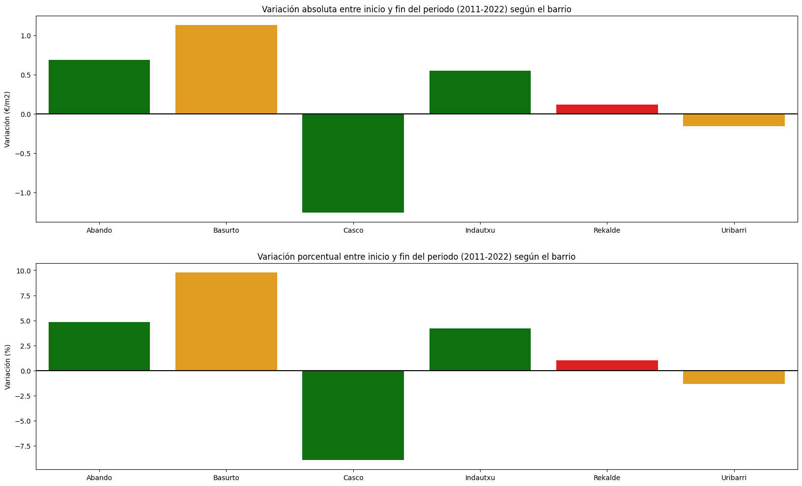

# Evolución de la renta en Euskadi, un vistazo a la distribución de la riqueza en Bilbao

***

## Índice

1. [Introducción](#Intro)

2. [Fuente de datos, metodología y definiciones](#data)

3. [Variables y definiciones](#var)

4. [Hipótesis](#hip)

5. [Procesamiento de lso datos](#proc)

    5.1 [Rentas](#Renta)

    5.2 [IPC](#ipc)

    5.3 [Alquileres](#Alq)
6. [Conclusiones](#Conc)

## Introducción 

En este proyecto se pretende analizar cómo ha evolucionado la renta en los diferentes distritos de Bilbao a lo largo de los últimos años.

Dentro de dicho estudio, se han tenido en cuenta varios indicadores procedentes de diferentes fuentes, como son los diferentes tipos de renta en los que se desglosa el cómputo total, el aumento del IPC a lo largo del mismo periodo de tiempo y la evolución de los precios de alquiler (€/$\text{m}^2$) en los diferentes distritos de Bilbao.

## Fuente de datos, metodología y definiciones 

Los datos han sido extraídos de la base de datos oficial de Euskadi, a través de [Eustat](https://www.eustat.eus/bankupx/pxweb/es/DB/-/PX_173402_crpf_rpf_rp22_2p.px/table/tableViewLayout2/).

Según la propias fuentes, la fiabilidad de estos resultados es del 89,62%.

>La RPF mantiene la correspondencia entre los ficheros procedentes de las Haciendas Forales y el Registro de Población de Eustat. El indicador de la Tasa de Fusión Bruta, que mide la media ponderada de porcentajes de fusión del Registro de Población con cada fuente utilizada, en 2022 ha sido de 89,62%.

En este conjunto de datos se ha tomado teniendo en cuenta únicamente a la población de más de 18 años, lo cual permite que la mayor o menor abundacia menores de edad no influya en la distribución de la renta.

Además, se han extraído los datos referentes a la evolución de los precios de alquiler y compra de los diferentes barrios de Bilbao de los datos públicos de [Idealista](https://www.idealista.com/sala-de-prensa/informes-precio-vivienda/venta/euskadi/vizcaya/bilbao/), así como los relativos a la evolución del IPC en el país vasco del [INE](https://www.ine.es/jaxiT3/Tabla.htm?t=50940&L=0).

## Variables y definiciones: 

* **Renta personal total**: Resulta de la agregación, para cada persona de 18 y más años, de sus rentas del trabajo, rentas derivadas de actividades económicas, transferencias o prestaciones sociales y las percibidas por el capital, tanto mobiliario como inmobiliario.

* **Renta del trabajo** : Se entiende por renta del trabajo la remuneración total, monetaria o no monetaria, que paga un empleador a su asalariado como contrapartida del trabajo realizado por éste durante el período de referencia de los ingresos.

* **Renta del capital mobiliario**: Se consideran rendimientos del capital mobiliario los intereses de cuentas bancarias, bonos, obligaciones y, en general, títulos de renta fija, los dividendos de acciones y las plusvalías obtenidas por la transmisión de cualquier tipo de valores mobiliarios, percibidos durante el período de referencia.  
En la práctica los rendimientos del capital mobiliario lo conforman los intereses, dividendos, plusvalías, etc. sin descontar las retenciones efectuadas. Sólo se tienen en cuenta intereses declarados de cuantía superior o igual a 5 euros.  
Bajo este epígrafe también se incluyen los rendimientos obtenidos en EPSVs (Entidades de Previsión Social Voluntaria). Se toma el 35% del rescate como estimación de las ganancias obtenidas. También dentro de este epígrafe se incluyen las ganancias y pérdidas patrimoniales derivadas de la transmisión de participaciones en fondos de inversión colectiva, acciones, seguros, etc.

* **Renta del capital inmobiliario**: Se consideran rendimientos del capital inmobiliario los que se derivan del arrendamiento o de la constitución o cesión de derechos o facultades de uso o disfrute sobre bienes inmuebles rústicos y urbanos, percibidos durante el período de referencia.

* **Renta de actividades económicas**: Se entienden por rendimientos de actividades económicas aquéllos que, procediendo del trabajo personal y del capital conjuntamente o de uno sólo de estos factores, suponen por parte del contribuyente la ordenación por cuenta propia de medios de producción o de recursos humanos con la finalidad de intervenir en la producción o distribución de bienes y servicios.

* **Transferencias**: Se entienden por transferencias las prestaciones sociales monetarias de cobertura obligatoria o basadas en el principio de solidaridad social (quedan excluidas por tanto las prestaciones sociales voluntarias).

* **Renta disponible**: Resulta de descontar a la renta personal total los gastos de Seguridad Social y la cuota líquida o las retenciones a cuenta.

## Hipótesis 

1. Pese al aparente aumento de la renta, el poder adquisitivo de los ciudadanos puede haber disminuido debido a la inflación.

2. Las diferencias entre los barrios con mayor poder adquisitivo respecto a aquellos más desfavorecidos se acentúan, aumentando las desigualdades.

3. La vivienda es un factor determinante respecto al incremento de la renta.

## Procesamiento de los datos 

A lo largo del desarrollo del análisis, se ha contado con diversos conjuntos de datos que se han tratado de manera separada. Los dividiremos según el origen de los mismos:

### Rentas 

En este conjunto de datos nos encontramos con una tabla en la que se recogen los diferentes tipos de renta de cada uno de los distritos de las tres capitales de provincia a lo largo de los años en los que se ha realizado el estudio (el periodo abarca desde el año 2006 hasta el año 2022).

Principalmente se ha tratado los datos correspondientes al municipio de Bilbao, aunque en una primera instancia se ha visualizado la evolución general en las tres capitales para poder obtener algo más de contexto respecto a esta evolución. 

Una vez tomada esta visión más general, se ha profundizado y analizado más detalladamente cómo afectan los diferentes tipos de renta en el cómputo global mediante la matriz de correlación y se ha puesto el foco en las diferencias entre los cinco barrios con mayor renta y los cinco cuya renta fue menor en el año 2022, tomando también como referencia la renta media de Bilbao.

En este estudio se pueden observar diferencias en la distribución de la renta. Por ejemplo, en la matriz de correlación, los barrios con mayor poder adquisitivo mantienen una fuerte dependencia en la mayoría de tipos de renta, excepto el de transferencias, mientras que en los barrios con menores recursos económicos esta relación estrecha solo se observa en la renta del trabajo.

También se ha analizado la variación (absoluta y porcentual) de cada uno de los tipos de renta entre el año 2011 y el año 2022 que han tenido de media los dos grupos de muestreo (esta decisión se ha tomado debido a que en los datos extraídos de los precios de alquileres a través de Idealista, no se disponía de los datos de años anteriores). 

Mediante estas gráficas se aprecia cómo, pese a la aparente equivalencia en cuanto a la variación porcentual, el aumento de la renta promedio en términos absolutos de los barrios con mayor poder adquisitivo es mucho mayor que el que se observa en los barrios con rentas más bajas.

### IPC 

Analizando la evolución del IPC en los últimos años, se ha tenido encuenta tanto la variación interanual de éste como la variación respecto a 2006. Gracias a esta segunda comparación, se ha podido establecer una comparación entre la evolución de la renta total y el poder adquisitivo. Obteniendo como resultado la siguiente gráfica: 

En la que se observa cómo, pese al incremento de la renta que se ha detectado anteriormente, el poder adquisitivo de los ciudadanos ha disminuido entorno al 7,5%.

Por otro lado, se ha tenido en cuenta también la variación del IPC asociado a la vivienda y suministros. Sin embargo, no se ha tenido en cuenta finalmente debido a la falta de conclusiones en la evolución de los precios del alquiler.

### Alquileres 

Extrayendo los datos de manera manual de la web de idealista, se han agrupado los datos de cada uno de los barrios en una tabla única, de manera similar a cómo se ha trabajado en lo referente a las rentas por los distritos.

Partiendo de los 10 distritos seleccionados en la primera parte, se han asociado a los barrios en los que los agrupa idealista en su web y se ha estudiado la evolución del precio por metro cuadrado en estos desde el año 2011 (primer año en el que hay datos desglosados por barrios).

Para una visualización más suave, se han procesado los datos correspondientes calculando el precio medio anual de los mismos, ya que los datos recogían el precio medio mensual.

De esta manera, se observa que en general hubo un descenso del precio en la primera mitad del periodo que posteriormente se revirtió y acabó con unos precios en general ligeramente superiores a los del inicio del periodo.

Sin embargo, aprovechando la disposición de los datos en años posteriores, se observa que este aumento de los precios se ha mantenido después del periodo estudiado.

## Conclusiones 

* **Hipótesis 1:** En la [figura 5](#image-4) se comprueba cómo el aumento de la renta no llega a alcanzar el crecimiento del IPC, resultando en una pérdida final del poder adquisitivo de aproximadamente un 7,5% respecto a 2006

* **Hipótesis 2:** Analizando las figuras [3](#image-2) y [4](#image-3), se aprecian varios elementos a destacar. En cuanto a la variación porcentual, se observa cierta similitud en el crecimiento de las rentas en todos los grupos, excepto en lo que respecta a la renta de capital mobiliario. Sin embargo, debido a la gran diferencia de rentas ya establecida desde el inicio del periodo, el incremento absoluto de las rentas resulta en una diferencia muy significativa entre los dos grupos. Así mismo, el descenso del capital mobiliario observado en los barrios más pobres es muy notorio en términos relativos, mientras que en términos absolutos no representa una cantidad tan significativa.

* **Hipótesis 3:** Partiendo del incremento porcentual del capital mobiliario visto en la [figura 3](#image-2), cabría esperear que este fuera ligado a un incremento en los precios de alquiler. Sin embargo, el incremento de estos observado en la [figura 7](#image-6) no se corresponde con el anterior, por este motivo es difícil sacar conclusiones, además de que sería conveniente ampliar el foco de estudio ya que una persona puede percibir una renta del alquiler de una vivienda ubicada en un barrio o municipio en el que no reside.